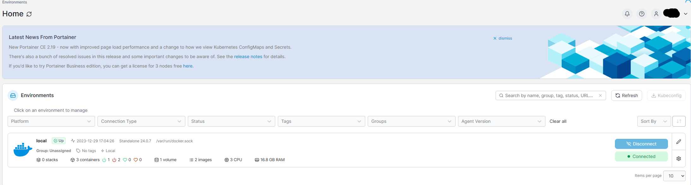
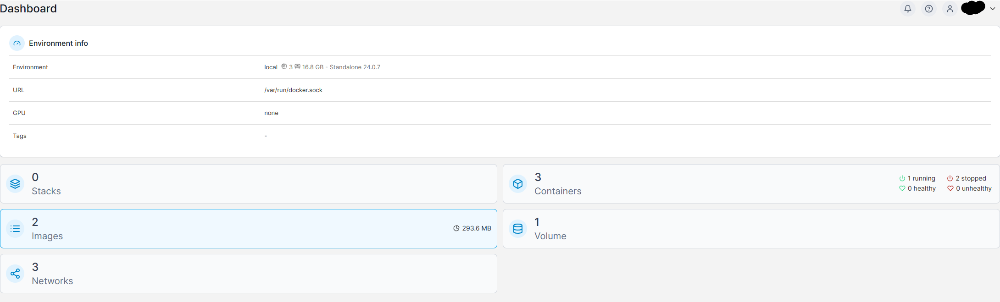
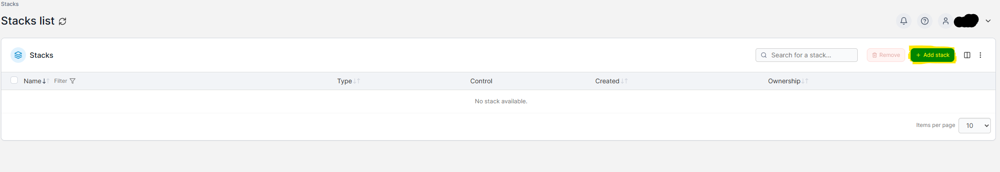
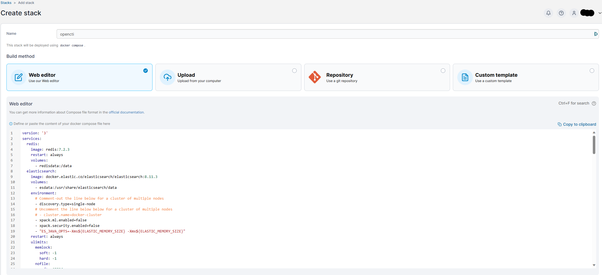
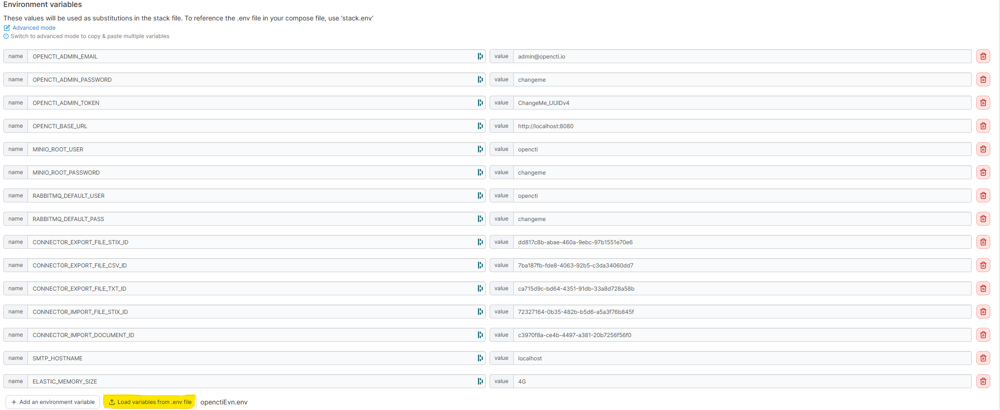

# Installing OPENCTI 
Here you can find docker compose file for a clean slate [here](https://github.com/OpenCTI-Platform/docker). Can also fin it here in this reposirtory. 

1. Go to portainer and add stack as shown below:
2. Go to environment called local and navigate to stacks

    
    --
    
    -- 
    Press add stack
    
3. Copy [Docker compose file](https://github.com/Erikfk99/Security/blob/main/openCTI/OpenCTI%20Installation/docker-ComposeClean.yml) and add paste in the web editor
   
4. Add your own edited env file from: (add link)
    
5. change variables that needs to be changed
   1. Change user names and passwords
   2. UUIDv4 can be created from here: [UUIDv4 Generator](https://www.uuidgenerator.net/version4)
6. Now you can press Deploy Stack and open openCTI on localhost:8080 or ip:8080