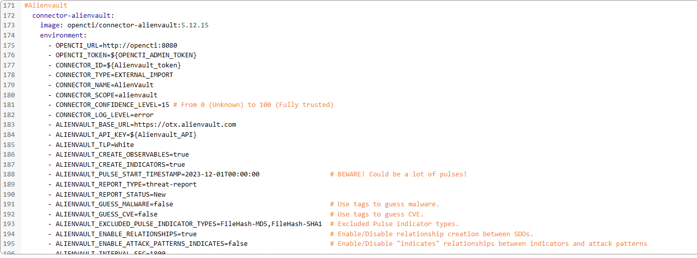

# Innstalling 

1. Create a ailenvault user and retreve your API Token
2. Add code in Yaml file to existing OPENCTI STACK
   1. Under services: 
   Could be smart to comment #Alienvault so you now where it begins
   
3. IN the variables section of portainer add what is in the alienvault.env file. 