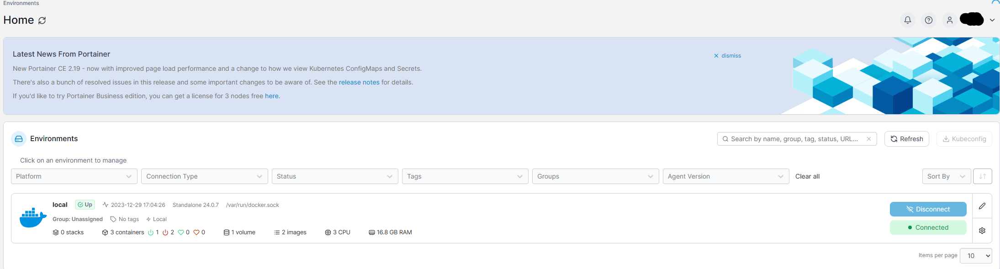
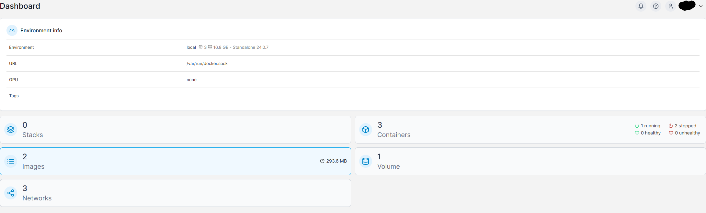
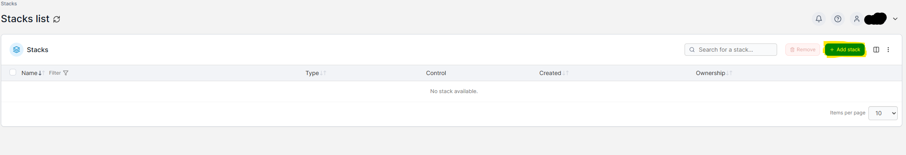

# Installing OPENCTI 
Here you can find docker compose file for a clean slate [here](https://github.com/OpenCTI-Platform/docker). Can also fin it here in this reposirtory. 

1. Use the docker compose file [This file](https://github.com/Erikfk99/Security/blob/main/openCTI/OpenCTI%20Installation/docker-ComposeClean.yml)
2. Go to environment called local and navigate to stacks
    
    --
    
    -- 
    Press add stack
    