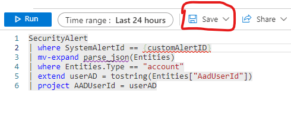
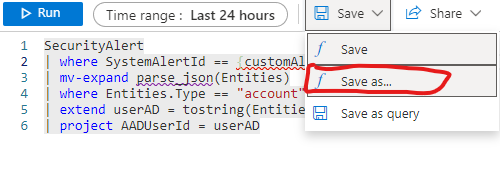
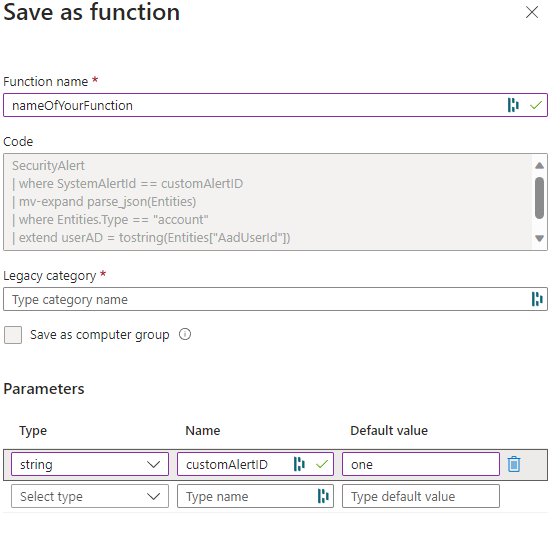
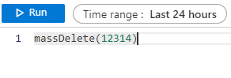

# Functions in log analytics workspace sentinel 
Using functions within your Microsoft Sentinel can speed up your querieing. Creating functions for things that you are usaully looking for, so you dont need to write similar expressions for everytime you create a query. One example would be looking for specific entities within a incident, here you can create a function that creates a table with only entites table. 

These functions are functions which I have used within Sentinel or log analytics workspaces. 

-- 

## How to save a query as a function 

A Small guide on how to save a KQL query as a function in microsoft Sentinel. 

1. Write down a query that you use often, such as getting a users AADID from an incident: 
   ```
    SecurityAlert
    | where SystemAlertID == {customAlertID}
    | mv-expand parse_json(Entities)
    | where Entities.Type == "account"
    | extend userAD = tostring(Entities["AadUserId"])
    | project AADUserId = userAD
   ```
2. When you have written the deciered query you can store it as a function
   1. Press Save: 
    
   2.  Press Save as.. 
    
   3.  "save as Function" windows open there is a few steps: 
       1.  Write the name of your function, give it a fitting name and create a naming convention that works for you
       2.  Legacy category 
       3.  Parameters: 
           1.  In the above query we have set that the parameter is "customAlertID" which should refere to a SystemAlertID in securityAlert table. 
           Therefore, it is important to write that correctly here when you are saving the function ref image below.
           2. give it a Default value: could be anything as long it is the same type that you defined. String then default value has to be a string. 
       4. Press save 
        
3. Using the Function: 
   1. Open a query window and start writing out your own function 
     ```
    {
        YourFunctionName({variable})
    }
   
   ```
   
