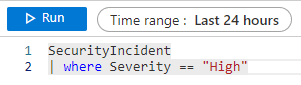
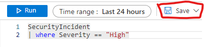
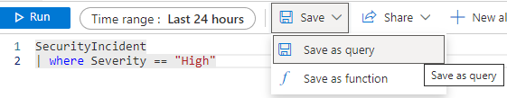
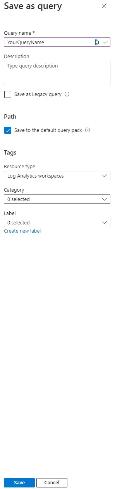

# Queries in log analytics workspace sentinel 
Queries are one of the most important things to have an understanding around when it comes to the use of Microsoft Sentinel. These are the integral parts which makes alerts and incidents appear on an security analysts screen. 

# What kind of queries can you find here

Her you will find custom queries, everything from hunting queries to queries that solves a specific problem. 

---

# How to save a query
Small guide on how to save a query in Sentinel. Will contain a small query just as an example 

1. Create your query
    
2. Press save 
    
3. press save as query
    
4. Save as query window will open: 
   1. Give your query a fitting name. in this case maybe "Security Incidents Severity High" Find a naming convention that fits your organisation
   This is the only part that is manditory here. Everything else in the window is optional. 
   2. Write a description so that other analysts can understand what the goal of the query is 
   3. Path: {your choice}
      1. "Save to the default query pack" 
         1. Checking this box saves your query to a query pack called "DefaultQueryPack" under a resource group called "LogAnalyticsDefaultResources" by default. Uncheck it if you want to save to another query pack.
      2. unchecking "save to default query pack 
         1. know you have to choose which subscription it should be in, what resource group and what log analytics query pack. 
      3. Tags
         1. Choose fitting resource type: usally I choose "log Analytics workspaces"
         2. Choose a fitting Category if desirable
         3. Choose a fitting label if desirable

